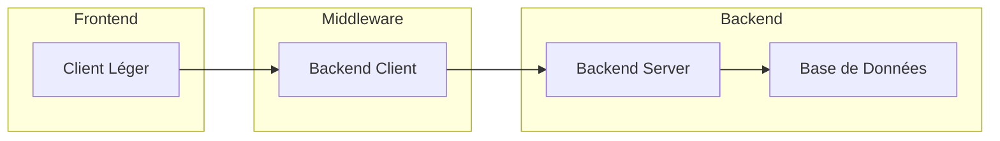

## 🏗️ Architecture de la Solution

Un aperçu détaillé de l’architecture technique du projet.

### 📊 Diagramme d'Architecture

Vous pouvez insérer un diagramme avec Mermaid pour illustrer l’architecture :  

👉 *Un beau schéma vaut mieux que le plus beau des discours !*

### ⚙️ Choix Architecturaux

- **📈 Scalabilité** : Comment l’architecture gère-t-elle la montée en charge ?
- **🔐 Sécurité** : Quelles mesures sont en place pour protéger les données ?
- **🛠️ Maintenabilité** : Comment l’architecture facilite-t-elle les mises à jour ?

