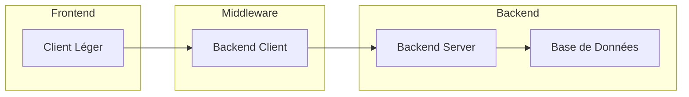


**Version :** {{ site.data.build_info.version }}
**Build Date :** {{ site.data.build_info.buildDate }}

Aucune information de build n'est disponible.


# Documentation Quickstart

Bienvenue dans la documentation rapide de **Nom du Projet**. Ce guide a pour objectif de vous aider à démarrer rapidement avec le projet, à comprendre son architecture et à vous lancer dans le développement.

## Introduction et Contexte

Dans cette section, vous découvrirez l'objectif du projet, ses fonctionnalités principales et le contexte dans lequel il a été développé.

## Architecture de la Solution

Ce chapitre présente une vue d'ensemble de l'architecture technique du projet.

### Diagramme d'Architecture

Pour insérer un diagramme au format mermaid dans votre documentation utilisez la balise mermaid:

\```mermaid

flowhart, diagramme de classe, voir : [mermaid](https://mermaid.js.org/)

\```

Insérez ici un diagramme illustrant les interactions entre les différents composants.  
Par exemple, vous pouvez ajouter une image ou utiliser un outil comme Mermaid pour générer un schéma dynamique.



### Composants Principaux

- **Front-end** : Présentation du framework ou de la bibliothèque utilisée (ex. React, Vue, Angular) et des fonctionnalités côté client.
- **Back-end** : Détails sur l'API ou le serveur (ex. Node.js, Django, Ruby on Rails) qui gère la logique applicative.
- **Base de données** : Type de base de données utilisée (SQL, NoSQL, etc.) et schéma général.
- **Services Externes** : Description des API tierces ou microservices intégrés au projet.

### Choix Architecturaux

- **Scalabilité** : Explication sur la manière dont l'architecture peut évoluer pour gérer une charge accrue.
- **Sécurité** : Mesures prises pour sécuriser les échanges de données et protéger le système.
- **Maintenabilité** : Approche modulaire et documentation des composants pour faciliter les mises à jour et l'extension du projet.

## Prérequis et Installation

Listez ici toutes les dépendances et les étapes nécessaires pour installer et configurer l'environnement de développement.

## Guide de Démarrage Rapide

Fournissez les commandes essentielles pour lancer le projet en local, compiler le code et démarrer le serveur.  
Exemple de commandes à insérer :

```bash
   cd docs
   bundle install
   bundle exec jekyll serve
```

Ensuite, rendez-vous sur [http://localhost:4000](http://localhost:4000) pour voir le résultat.

## Contribution

Si vous souhaitez contribuer au projet, consultez cette section pour connaître les règles de contribution, les conventions de commits et le processus de pull request.

## FAQ et Ressources Supplémentaires

Cette section rassemble les réponses aux questions fréquentes, des astuces pour résoudre les problèmes courants et des liens vers des ressources complémentaires (documentation détaillée, tutoriels, etc.).

## Démarrer avec Just the Docs

Ce template intègre le thème [Just the Docs](https://just-the-docs.github.io/just-the-docs/), idéal pour créer une documentation claire et structurée. Pour bien démarrer :

1. Consultez la [documentation officielle de Just the Docs](https://just-the-docs.github.io/just-the-docs/) pour découvrir toutes les options de configuration et de personnalisation.
2. Explorez les exemples et les options de navigation offertes par le thème.
3. Adaptez le contenu du répertoire `docs` selon vos besoins en suivant les guides proposés.

Bonne lecture et n'hésitez pas à contribuer pour améliorer le projet !

---
Ce projet est sous licence MIT. Voir le fichier [LICENSE](LICENSE) pour plus d'informations.
