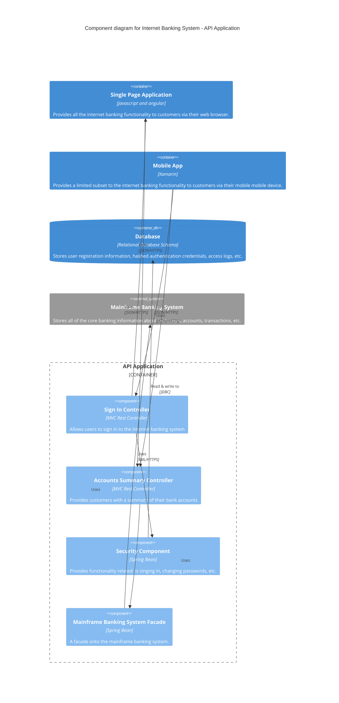

# Components Overview

This document provides an overview of the components that make up **Container1**.  
All components inside a container execute in the same process space. Aspects such as how components are packaged (e.g. one component vs many components per JAR file, DLL, shared library, etc) is an orthogonal concern.

## Example: Internet Banking System Components

